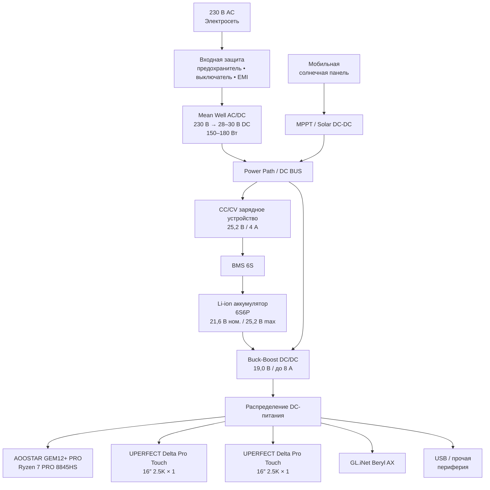

```mermaid
flowchart TB

    AC["230 В AC<br/>Электросеть"]
    SOL["Мобильная<br/>солнечная панель"]

    AC --> AC_PROT["Входная защита<br/>предохранитель • выключатель • EMI"]
    AC_PROT --> PSU["Mean Well AC/DC<br/>230 В → 28–30 В DC<br/>150–180 Вт"]

    SOL --> MPPT["MPPT / Solar DC-DC"]

    PSU --> PWRPATH["Power Path / DC BUS"]
    MPPT --> PWRPATH

    PWRPATH --> CHARGER["CC/CV зарядное устройство<br/>25,2 В / 4 А"]

    CHARGER --> BMS["BMS 6S"]
    BMS --> BAT["Li-ion аккумулятор<br/>6S6P<br/>21,6 В ном. / 25,2 В max"]

    BAT --> DCUPS["Buck-Boost DC/DC<br/>19,0 В / до 8 А"]

    PWRPATH --> DCUPS

    DCUPS --> LOADS["Распределение DC-питания"]

    LOADS --> PC["AOOSTAR GEM12+ PRO<br/>Ryzen 7 PRO 8845HS"]

    LOADS --> MON1["UPERFECT Delta Pro Touch<br/>16″ 2.5K × 1"]
    LOADS --> MON2["UPERFECT Delta Pro Touch<br/>16″ 2.5K × 1"]

    LOADS --> ROUTER["GL.iNet Beryl AX"]

    LOADS --> USB["USB / прочая<br/>периферия"]
```