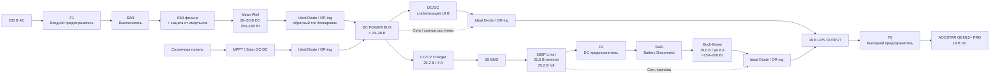

```mermaid
flowchart LR

    %% ===== AC INPUT =====

    AC["230 В AC"] 
        --> F1["F1<br/>Входной предохранитель"]
    F1 --> SW1["SW1<br/>Выключатель"]
    SW1 --> EMI["EMI-фильтр<br/>+ защита от импульсов"]

    EMI --> PSU["Mean Well<br/>28–30 В DC<br/>150–180 Вт"]


    %% ===== DC INPUT =====

    PSU --> D1["Ideal Diode / OR-ing<br/>обратный ток блокирован"]


    %% ===== SOLAR =====

    SOL["Солнечная панель"] 
        --> MPPT["MPPT / Solar DC-DC"]
    MPPT --> D2["Ideal Diode / OR-ing"]


    D1 --> BUS["DC POWER BUS<br/>≈ 24–28 В"]
    D2 --> BUS


    %% ===== CHARGING =====

    BUS --> CHG["CC/CV Charger<br/>25,2 В / 4 А"]

    CHG --> BMS["6S BMS"]

    BMS --> BAT["6S6P Li-ion<br/>21,6 В nominal<br/>25,2 В full"]


    %% ===== BATTERY OUTPUT =====

    BAT --> F2["F2<br/>DC предохранитель"]
    F2 --> SW2["SW2<br/>Battery Disconnect"]

    SW2 --> BB["Buck-Boost<br/>19,0 В / до 8 А<br/>≈150–200 Вт"]


    %% ===== OUTPUT OR-ING =====

    BUS --> CONV["DC/DC<br/>стабилизация 19 В"]

    CONV --> D3["Ideal Diode / OR-ing"]
    BB --> D4["Ideal Diode / OR-ing"]

    D3 --> OUT["19 В UPS OUTPUT"]
    D4 --> OUT


    %% ===== LOAD =====

    OUT --> F3["F3<br/>Выходной предохранитель"]

    F3 --> PC["AOOSTAR GEM12+ PRO<br/>19 В DC"]


    %% ===== OPERATION =====

    BUS -. "Сеть / солнце доступны" .-> D3
    BAT -. "Сеть пропала" .-> D4
```