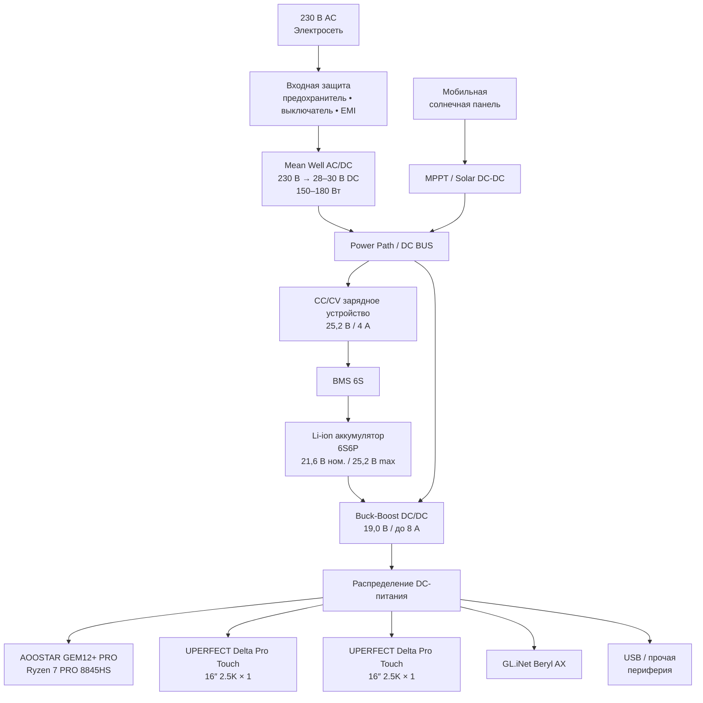
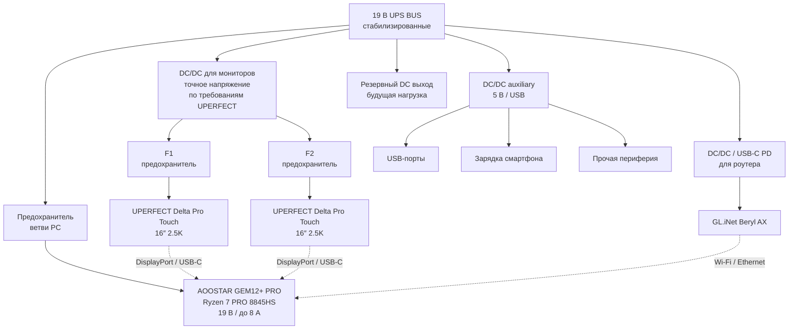

# Portable DC-UPS / Power Hub

## 1. Архитектура системы

## 2. Силовая часть UPS

```mermaid
flowchart LR

    %% ===== AC INPUT =====

    AC["230 В AC"] 
        --> F1["F1<br/>Входной предохранитель"]
    F1 --> SW1["SW1<br/>Выключатель"]
    SW1 --> EMI["EMI-фильтр<br/>+ защита от импульсов"]

    EMI --> PSU["Mean Well<br/>28–30 В DC<br/>150–180 Вт"]


    %% ===== DC INPUT =====

    PSU --> D1["Ideal Diode / OR-ing<br/>обратный ток блокирован"]


    %% ===== SOLAR =====

    SOL["Солнечная панель"] 
        --> MPPT["MPPT / Solar DC-DC"]
    MPPT --> D2["Ideal Diode / OR-ing"]


    D1 --> BUS["DC POWER BUS<br/>≈ 24–28 В"]
    D2 --> BUS


    %% ===== CHARGING =====

    BUS --> CHG["CC/CV Charger<br/>25,2 В / 4 А"]

    CHG --> BMS["6S BMS"]

    BMS --> BAT["6S6P Li-ion<br/>21,6 В nominal<br/>25,2 В full"]


    %% ===== BATTERY OUTPUT =====

    BAT --> F2["F2<br/>DC предохранитель"]
    F2 --> SW2["SW2<br/>Battery Disconnect"]

    SW2 --> BB["Buck-Boost<br/>19,0 В / до 8 А<br/>≈150–200 Вт"]


    %% ===== OUTPUT OR-ING =====

    BUS --> CONV["DC/DC<br/>стабилизация 19 В"]

    CONV --> D3["Ideal Diode / OR-ing"]
    BB --> D4["Ideal Diode / OR-ing"]

    D3 --> OUT["19 В UPS OUTPUT"]
    D4 --> OUT


    %% ===== LOAD =====

    OUT --> F3["F3<br/>Выходной предохранитель"]

    F3 --> PC["AOOSTAR GEM12+ PRO<br/>19 В DC"]


    %% ===== OPERATION =====

    BUS -. "Сеть / солнце доступны" .-> D3
    BAT -. "Сеть пропала" .-> D4
```

## 3. Распределение питания

## Основные параметры

| Узел            | Параметр                         |
| --------------- | -------------------------------- |
| Battery         | 6S6P Li-ion                      |
| Battery nominal | 21,6 V                           |
| Battery full    | 25,2 V                           |
| Charger         | 25,2 V / 4 A                     |
| PC input        | 19 V / до 8 A                    |
| PC power        | до 150–200 W                     |
| AC PSU          | 28–30 V / 150–180 W              |
| Router          | GL.iNet Beryl AX                 |
| Displays        | 2 × UPERFECT Delta Pro Touch 16" |